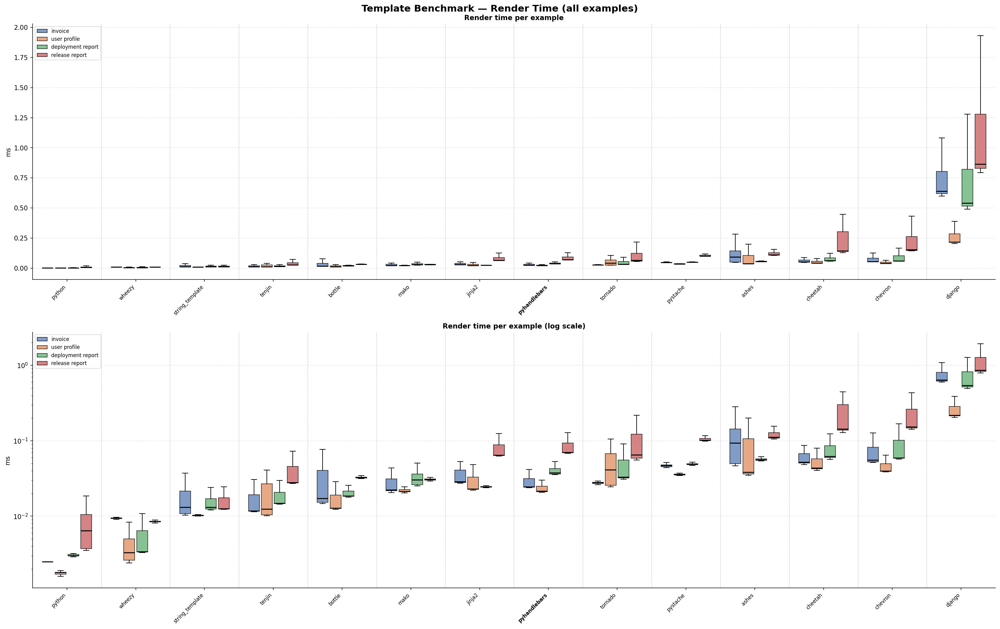

# PyHandlebars

Python library for the [handlebars](https://handlebarsjs.com) templating language. It is a small wrapper around the [handlebars-rust](https://github.com/sunng87/handlebars-rust) library.


## Installation
Pyhandlebars is listed on [PyPi](https://pypi.org/project/pyhandlebars/): 
```sh
pip install pyhandlebars
```

## Getting Start

### 1. Simple Template

```python
from pyhandlebars import Template

t: Template = Template("Hallo {{name}}")
rendered_text = t.format({"name": "world"})"

# Returns "Hello world"
```

### 2. Pydantic BaseModel Support

```python
def test_simple_pydantic_support():
    from pyhandlebars import Template
    from pydantic import BaseModel

    class Person(BaseModel):
        name: str

    t: Template[Person] = Template("This is {{name}}!")
    rendered_text = t.format(Person(name="Alice"))
    assert rendered_text == "This is Alice!"
```

### 3. Default Global Client

Every `Template` created without an explicit `client=` argument shares a single process-wide global client. This means partials and helpers registered on one template are immediately available to all other templates that use the default client.

```python
from pyhandlebars import Template

# Both templates share the global client — the partial is visible to t2.
_ = Template("Hi {{name}}", name="greeting")
t = Template("{{> greeting}}")
print(t.format({"name": "Bob"}))  # Hi Bob
```

### 4. Adding Helper Functions
PyHandlebars allows you to register your own helper functions. However, keep in mind that these are not as fast and
performant as built-in helpers.

Each helper receives two arguments: `params` (a list of positional arguments from the template call) and `context` (the full data object passed to `format`).

**Option A — `PyHandlebars.helper` on the global client**

Access `helper` on the *class* (not an instance) to register directly on the global client — no explicit `PyHandlebars()` needed.

```python
from pyhandlebars import PyHandlebars, Template

@PyHandlebars.helper
def shout(params: list, context: dict):
    return f"{params[0].upper()} from {context['location']}"

# Supply a custom template name with name=
@PyHandlebars.helper(name="whisper")
def my_whisper_fn(params: list, context: dict):
    return params[0].lower()

t = Template("{{shout name}} / {{whisper name}}")
assert t.format({"name": "Alice", "location": "Wonderland"}) == "ALICE from Wonderland / alice"
```

**Option B — `register_helper` / `@client.helper()` on a dedicated client**

Use an explicit `PyHandlebars()` instance when you want helpers isolated from the global client.

```python
from pyhandlebars import PyHandlebars, Template

def shout(params: list, context: dict):
    return f"{params[0].upper()} from {context['location']}"

client = PyHandlebars()
client.register_helper("shout", shout)

# Decorator style:
@client.helper()
def whisper(params: list, context: dict):
    return params[0].lower()

t = Template("{{shout name}} / {{whisper name}}", client=client)
assert t.format({"name": "Alice", "location": "Wonderland"}) == "ALICE from Wonderland / alice"
```

### 5. More Examples
More examples can be found in the tests/test_examples.py file.

## Supported Template Functions 
The original HandlebarsJS supports different [Built-in Helpers](https://handlebarsjs.com/guide/builtin-helpers.html). PyHandlebars supports the following subset (given by [handlebars-rust](https://docs.rs/handlebars/latest/handlebars/#built-in-helpers)): 

```handlebars
{{{{raw}}}} ... {{{{/raw}}}} Escape handlebars expression within the block

{{#if ...}} ... {{else}} ... {{/if}} if-else block
Boolean Operators can be used here, for example {{#if (gt 2 1)}} ...
- other operator: eq, ne, gt, gte, lt, lte, and, or, not

{{#unless ...}} ... {{else}} .. {{/unless}} if-not-else block

{{#each ...}} ... {{/each}} iterates over an array or object. Handlebars-rust doesn’t support mustache iteration syntax so use each instead.

{{#with ...}} ... {{/with}} change current context. Similar to {{#each}}, used for replace corresponding mustache syntax.

{{lookup ... ...}} get value from array or map by @index or @key

{{> ...}} include template by its name

{{len ...}} returns length of array/object/string
```

## Comparison to other Template Engines in Python

We benchmarked PyHandlebars against 13 other Python template engines across 4 examples, running 1,000 iterations each. Each benchmark measures two phases:

- **Prepare** — compiling / registering the template (done once per request cycle in a real app)
- **Render** — filling data into the compiled template (the hot path)

### Examples

| Example | What it tests |
|---|---|
| **Invoice** | Simple variable substitution and list iteration over line items with a nested address |
| **User profile** | A boolean conditional (verified badge) combined with iteration over social links |
| **Deployment report** | Nested object access and dictionary lookups — status labels and region info keyed by name |
| **Release report** | Deep nesting — components each containing a test suite and a dependency list, plus environment conditionals |

### Results

Each box shows the render-time distribution across 1,000 runs. Tools are sorted fastest → slowest by average render time. The top chart uses a linear scale; the bottom uses a log scale to make differences between fast engines visible.



## Contribution
Any contribution to this library is welcomed. To get started into development! When you run into any problems, feel free to reach out to me.

## Notes
I mainly setup the library for the use case of prompt templating. If you miss something, just send me a DM or feel free to jump in with a PR 💫

## License
This library (PyHandlebars) is open sourced under the MIT License.